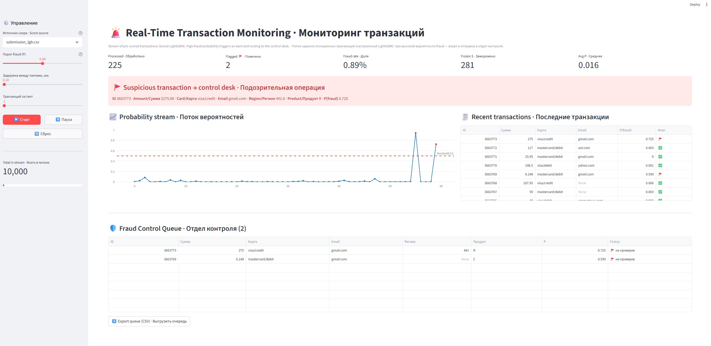

# IEEE-CIS Fraud Detection

**English** | [Русский](README.ru.md)


A machine-learning project for detecting fraudulent online transactions, based on the
[IEEE-CIS Fraud Detection](https://www.kaggle.com/c/ieee-fraud-detection) Kaggle competition.

The project implements a clean end-to-end pipeline (three notebooks) together with a real-time
Streamlit monitoring dashboard. The main focus is on **feature engineering, honest validation
and model interpretability** rather than on increasingly complex ensembles.



---

## Highlights

* Best validation ROC-AUC (LightGBM): **0.93797**
* Best Kaggle **Private** Leaderboard ROC-AUC: **0.919338**
* Time-aware validation (no leakage from the future)
* Hyperparameter tuning with **Optuna**
* **SHAP** explainability
* Real-time **Streamlit** monitoring dashboard

---

## Tech Stack

Python · pandas · NumPy · scikit-learn · LightGBM · XGBoost · CatBoost · Optuna · SHAP ·
Plotly · Streamlit · joblib · pyarrow

---

## Competition & Dataset

The project is based on the [IEEE-CIS Fraud Detection](https://www.kaggle.com/c/ieee-fraud-detection)
Kaggle competition, organized by the IEEE Computational Intelligence Society and Vesta Corporation.

**Task:** predict the probability that an online transaction is fraudulent (`isFraud`).
**Metric:** ROC-AUC.

**Dataset size:**

* ~590K training transactions
* ~506K test transactions
* 471 engineered features

The dataset is highly imbalanced: only about **3.5%** of transactions are fraud, which makes
the validation strategy and metric choice especially important.

Raw files used: `train_transaction.csv`, `train_identity.csv`, `test_transaction.csv`,
`test_identity.csv`. The data itself is **not included** in the repository because of its size —
download it from the competition page.

---

## Project Structure

| Notebook | Description |
| --- | --- |
| `fraud_01_data_prep_features.ipynb` | Data loading, EDA, preprocessing and feature engineering |
| `fraud_02_modeling_tuning.ipynb` | Baselines, Optuna tuning, SHAP analysis and threshold tuning |
| `fraud_03_inference_submission.ipynb` | Test scoring and Kaggle submissions |

Additional folders:

* `data/processed/` — parquet datasets
* `models/` — saved models and Optuna studies
* `submissions/` — Kaggle submissions
* `app/` — Streamlit dashboard

---

## Pipeline

### 1. Data Preparation & Feature Engineering

* Transaction and identity table merging
* Memory optimization
* Missing-value handling
* Categorical encoding
* Time-normalized D-columns
* Aggregation features
* Frequency encoding
* Email and interaction features

### 2. Validation Strategy

Transactions are ordered in time and the competition test set represents the future.
A random K-Fold mixes past and future observations and tends to overestimate performance.
Therefore, the project uses a **time-aware holdout**:

* earliest 80% → training
* latest 20% → validation

### 3. Modeling & Hyperparameter Tuning

Baseline ROC-AUC:

| Model | ROC-AUC |
| --- | ---: |
| XGBoost | 0.92631 |
| LightGBM | 0.92463 |
| CatBoost | 0.89900 |
| Logistic Regression | 0.81995 |

After Optuna tuning:

| Model | Baseline | Tuned | Gain |
| --- | ---: | ---: | ---: |
| LightGBM | 0.92463 | **0.93797** | +0.01334 |
| XGBoost | 0.92631 | 0.93580 | +0.00949 |
| CatBoost | 0.89900 | 0.92802 | +0.02902 |

The three gradient-boosting models clearly outperform logistic regression, indicating strong
non-linear relationships in the data.

### 4. Explainability

SHAP analysis on the best LightGBM model shows that the strongest predictors include:

* activity counters (C1, C11, C13, C14)
* transaction amount
* card-based aggregation features
* normalized D-columns
* frequency features

Several **manually engineered** features appear among the most influential, confirming the
value of the feature-engineering work.

### 5. Threshold Tuning

The model outputs probabilities rather than binary labels. The classification threshold affects
operational decisions but **not** the ROC-AUC score. The optimal threshold depends on the
business trade-off between false positives and missed fraud.

### 6. Inference & Submission

Test transactions are scored with the saved models. Submissions are generated as probabilities,
and an optional **rank-average** ensemble is used to combine model predictions.

---

## Results

### Kaggle Leaderboard

| Submission | Public LB | Private LB |
| --- | ---: | ---: |
| LightGBM + XGBoost | 0.948949 | **0.919338** |
| LightGBM | 0.949379 | 0.919059 |
| XGBoost | 0.946904 | 0.917151 |
| LightGBM + XGBoost + CatBoost | 0.947121 | 0.915877 |
| CatBoost | 0.934277 | 0.897988 |

Although the LightGBM + XGBoost blend achieved the highest private score, the difference from a
single LightGBM model is negligible (0.919338 vs 0.919059). The **tuned LightGBM** was therefore
selected as the final model — it is simpler, faster and easier to maintain.

This is a clean, readable end-to-end pipeline built for learning and portfolio purposes rather
than a maximally-stacked competition entry; the gap to the very top of the leaderboard is
expected (top solutions relied on aggressive UID feature engineering and large ensembles).

---

## Demo

### Real-Time Monitoring Dashboard (Streamlit)

The dashboard replays pre-scored transactions as if they arrive in real time. When a
transaction's fraud probability crosses the threshold, an alert fires and the transaction is
routed to a review queue.

Features:

* live probability stream
* fraud alerts
* fraud-control review queue (exportable to CSV)
* processed / flagged counters and estimated fraud rate
* frozen-amount statistics
* configurable threshold and model switching from the sidebar

```bash
streamlit run app/streamlit_app.py
```

---

## Key Takeaways

* Feature engineering contributed more to leaderboard performance than model complexity.
* Time-aware validation provides more realistic estimates than random K-Fold.
* Adding weaker models to an ensemble can *reduce* performance.
* SHAP confirmed the importance of manually engineered features.
* Complexity is not always rewarded.

**Main takeaway:** careful feature engineering and an honest validation strategy can contribute
more to fraud-detection performance than increasingly complex model ensembles.

---

## Environment

```bash
conda env create -f environment.yml
conda activate fraud
```

Python 3.10. Run the notebooks in order: `01 → 02 → 03`.

---

## Author

**Maksym Chunikhin**
[GitHub](https://github.com/MaksymChunikhin)
